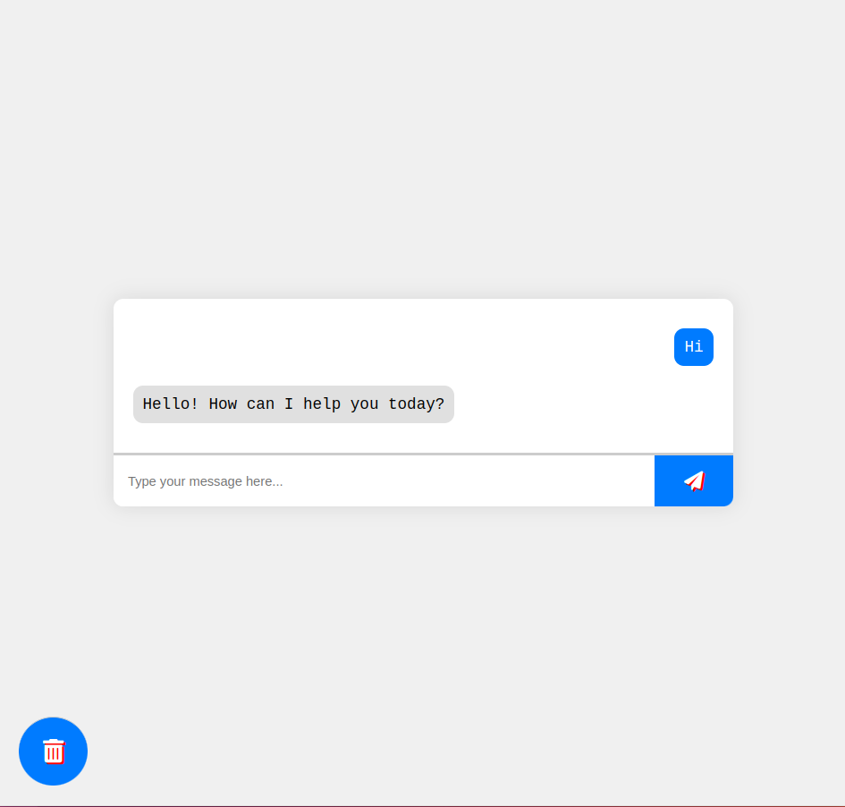

# Advanced Chatbot

Welcome to the advanced chatbot application built with Flask, HTML, CSS, and JavaScript. This chatbot is capable of learning new responses dynamically from user input, making it a powerful tool for various applications.

## Setup

1. **Clone the Repository:**
    ```bash
    git clone https://github.com/ariktheone/chat_bot_using_PYTHON.git
    cd chatbot
    ```

2. **Create and Activate a Virtual Environment:**
    ```bash
    python -m venv venv
    source venv/bin/activate  # On Windows use `venv\Scripts\activate`
    ```

3. **Install Dependencies:**
    ```bash
    pip install -r requirements.txt
    ```

4. **Run the Flask Application:**
    ```bash
    python3 chatbot.py
    ```

5. **Open a Web Browser:**
    Open a web browser and go to `http://127.0.0.1:5000`.

## Usage

- Type a message in the input box and press "Send".
- If the bot doesn't know the answer, it will ask you to teach it.
- Provide the correct answer when prompted, and the bot will learn from it.

## Files

- `chatbot.py`: The main Flask application.
- `templates/index.html`: The HTML file for the frontend.
- `static/css/styles.css`: The CSS file for styling.
- `static/js/script.js`: The JavaScript file for client-side logic.
- `data/training_data.json`: The initial training data for the chatbot.

## Example Image



